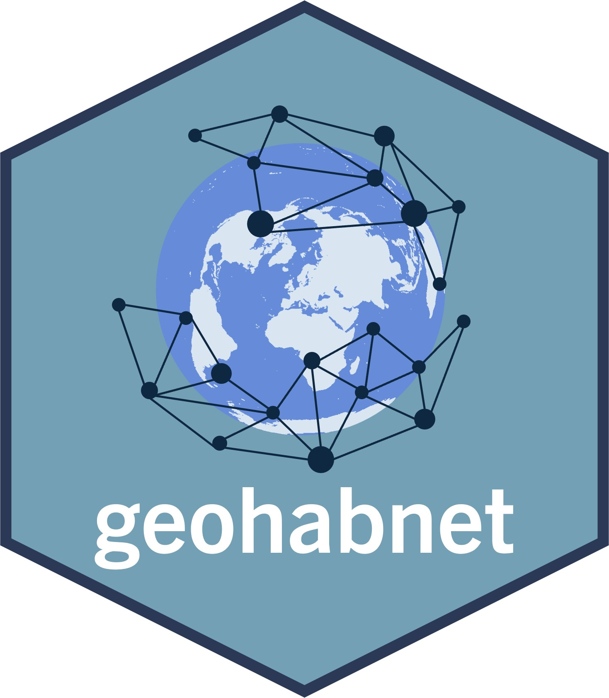

<nav>
    <a href="index.html">Home</a> |
    <a href="events.html">Events</a> |
    <a href="publications.html">Publications</a> |
    <a href="poetry.html">Poetry</a> |
    <a href="software.html">Software</a> |
    <a href="videos.html">Videos</a>
</nav>

<!-- add pictures where Plex participated here -->

    

The geohabnet package is available at

 - [CRAN](https://cran.r-project.org/web/packages/geohabnet/index.html)
 - [GitHub](https://github.com/GarrettLab/HabitatConnectivity)
 - [Webpage](https://garrettlab.github.io/HabitatConnectivity/index.html)