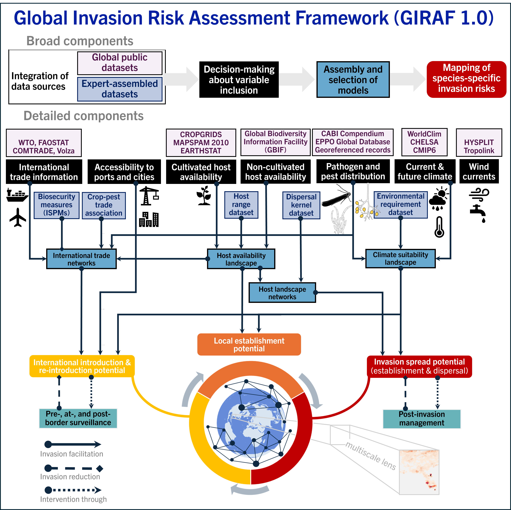
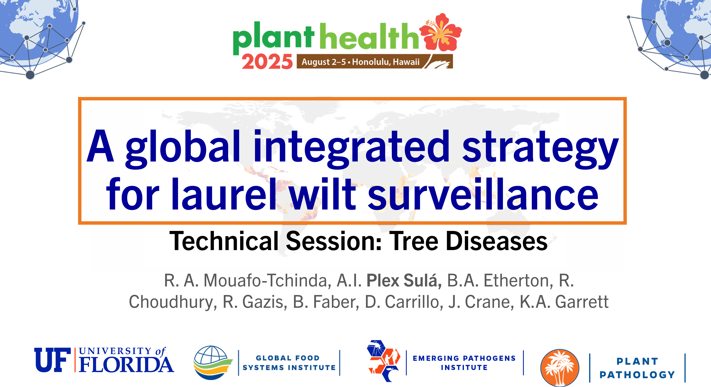
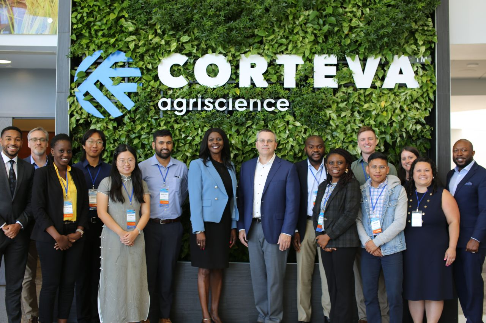
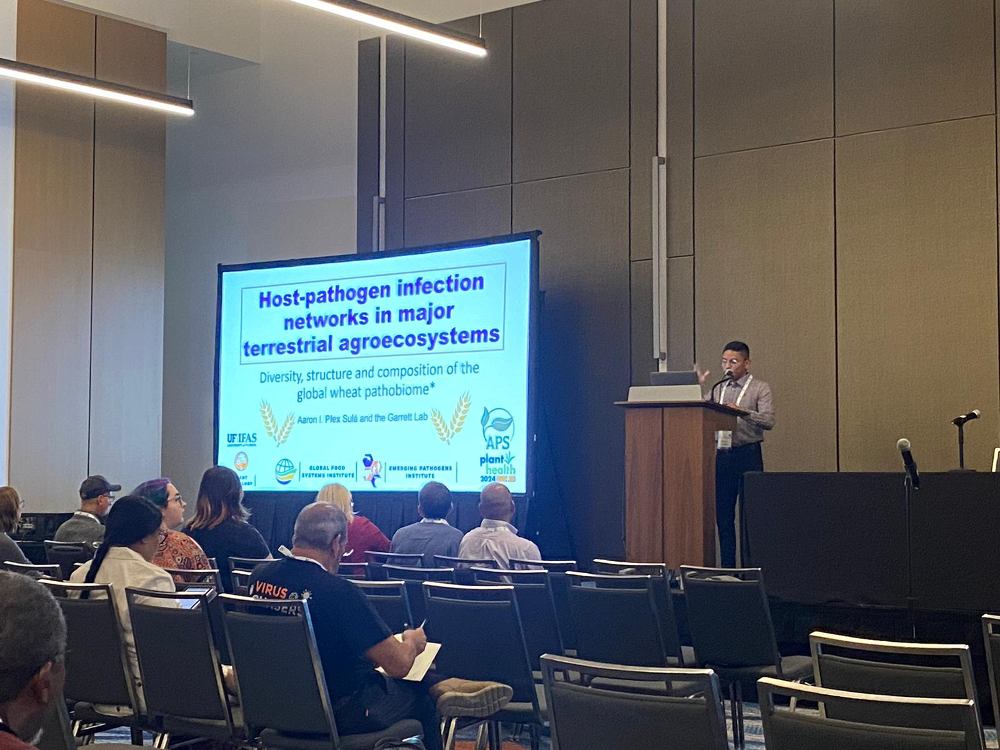

<nav>
    <a href="index.html">Home</a> |
    <a href="events.html">Events</a> |
    <a href="publications.html">Publications</a> |
    <a href="poetry.html">Poetry</a> |
    <a href="software.html">Software</a> |
    <a href="videos.html">Videos</a>
</nav>

**Upcoming events**

Plex is pleased to deliver an oral presentation as part of the [IPRRG](https://pestrisk.org/iprrg-2025/) webinar series. Join us in discussing the new global invasion risk assessment for plant pests (GIRAF 1.0)
in December.

    

**Selected past events**

August 5, 2025
 - Plex was invited to present about GIRAF 1.0 at Plant Health 2025 in Honolulu, Hawaii.
 

    

 - Plex also delivered a selected oral presentation on the technical session about tree diseases at the Plant Health 2025 in Honolulu, Hawaii. A PDF copy of this presentation is available at 

    

October 9, 2024
 - Plex received the New Frontiers Scholar Award and participated in the national conference on climate change in agriculture at Corteva Agriscience's headquarter in Indianapolis, Indiana.

    

April 9, 2024
 - Plex presented his work on host-pathogen infection networks in major terrestrial agroecosystems at the International Epidemiology Workshop in Foz de Iguazu, Brazil.

    

August 23, 2023
 - Plex was selected to present research progress on global biosecurity at the 12th International Congress of Plant Pathology, held in Lyon, France.

December 7, 2019
 - Plex graduated as an engineer in agriculture from the prestigious Zamorano University, in Honduras.

    

