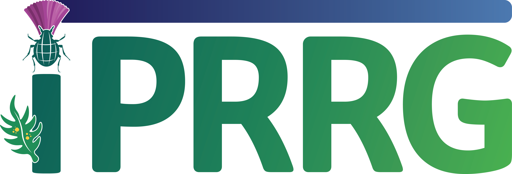

<nav>
    <a href="index.html">Home</a> |
    <a href="events.html">Events</a> |
    <a href="publications.html">Publications</a> |
    <a href="poetry.html">Poetry</a> |
    <a href="software.html">Software</a> |
    <a href="videos.html">Videos</a>
</nav>

**Upcoming events**

Plex is pleased to deliver an oral presentation as part of the [IPRRG](https://pestrisk.org/iprrg-2025/) webinar series. Join us in discussing the new global invasion risk assessment for plant pests (GIRAF 1.0)
in December.

    

**Selected past events**

August 5, 2025
 - Plex was invited to provide an oral presentation at the Plant Health 2025 in Honolulu, Hawaii.

August 23, 2023
 - Plex was selected to present research progress on global biosecurity at the 12th International Congress of Plant Pathology, held in Lyon, France.
